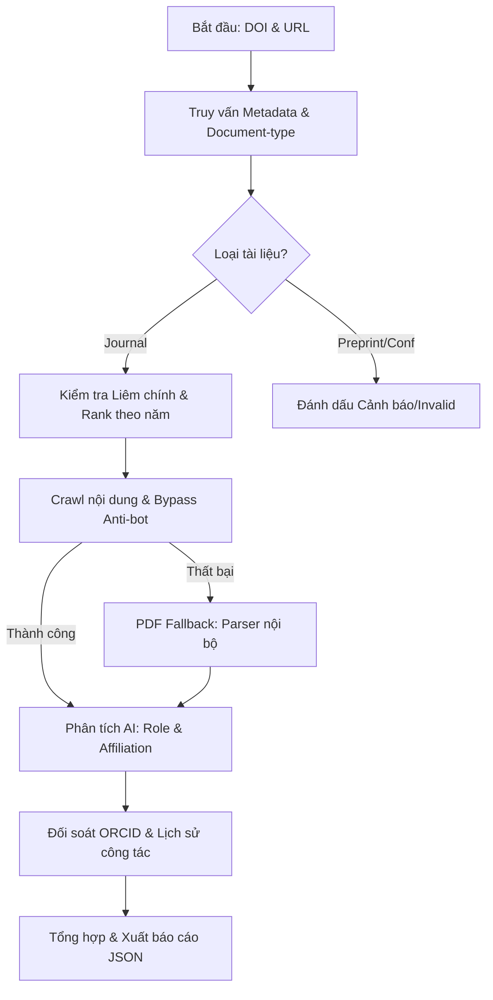

# Báo cáo Chi tiết Luồng Xử lý và Giải pháp Công nghệ (Hệ thống Quản lý Khoa học)

Tài liệu này mô tả chi tiết kiến trúc, luồng xử lý và các giải pháp kỹ thuật đã/đang được áp dụng để giải quyết các thách thức trong việc xác thực công trình khoa học.

---

## 1. Kiến trúc Luồng Công việc (Advanced Workflow)

Hệ thống kế hợp sức mạnh của **API chính thống**, **Headless Browser** và **Generative AI** để tạo ra một quy trình xác thực đa tầng, đảm bảo tính chính xác tối đa.

---

## 2. Các Giải pháp Cơ chế Logic Đặc thù

### 2.1. Xác thực Metadata & Phân loại Tài liệu
- **Document-type Check**: Sử dụng Crossref API để lọc bỏ các bản thảo chưa qua kiểm duyệt (`posted-content`/`preprint`) hoặc kỷ yếu hội thảo (`proceedings-article`) nếu yêu cầu chỉ tính bài báo tạp chí.
- **Time-based Journal Ranking**: Không sử dụng thứ hạng hiện tại. Hệ thống thực hiện truy vấn cơ sở dữ liệu SCImago/Scopus để lấy chỉ số Q1-Q4 tại đúng **Năm xuất bản** của bài báo.

### 2.2. Chiến thuật Thu thập Dữ liệu & Tính kiên cố (Resilience)
- **Crawl4AI (Playwright)**: Sử dụng trình duyệt không đầu mô phỏng hành động thực của con người, tích hợp Proxy xoay vòng để vượt qua tường lửa của Elsevier, Springer.
- **Cơ chế dự phòng PDF**: Trong trường hợp Publisher chặn bot hoàn toàn (Cloudflare/CAPTCHA), hệ thống kích hoạt luồng **PDF Crawler**. Người dùng có thể upload bản PDF, hệ thống sử dụng `PDF parser` để bóc tách text và metadata ẩn trong file.

### 2.3. Giám định Vai trò Tác giả & Liêm chính (AI-Powered)
- **Author Disambiguation**: 
    - AI (GPT-4/Gemini) thực hiện trích xuất các ký hiệu đặc biệt (`*`, `†`, `✉`) và vị trí tên.
    - **Co-first Authors**: AI được huấn luyện để nhận diện các ghi chú "Equal contribution" ở Footnotes, đảm bảo không bỏ sót các ứng viên là đồng tác giả thứ nhất.
- **Affiliation Cross-check**: Để tránh nhầm lẫn giữa những người trùng tên (Homonyms), hệ thống đối chiếu **Địa chỉ cơ quan (Affiliation)** ghi trên bài báo với **Lịch sử công tác** của ứng viên tại thời điểm đó.

---

## 3. Danh sách Công nghệ sử dụng (Tech Stack)

| Thành phần | Công nghệ | Mục đích |
| :--- | :--- | :--- |
| **Core Engine** | Python 3.10+, Asyncio | Xử lý bất đồng bộ nhiều bài báo cùng lúc. |
| **Data Source** | Crossref / Scopus API | Lấy Metadata chuẩn hóa và chỉ số ISSN. |
| **Scraping** | Crawl4AI / Playwright | Thu thập nội dung toàn văn (Full-text) từ URL. |
| **AI Extraction** | Ollama / GPT-4 / Gemini | Phân tích ngữ nghĩa, xác định vai trò và Affiliation. |
| **String Logic** | TheFuzz (FuzzyWuzzy) | So khớp tiêu đề tiếng Anh - Việt và tên tác giả. |
| **Validation** | Pydantic | Đảm bảo tính nhất quán của dữ liệu (Strongly-typed). |

---

## 4. Trạng thái và Phân loại Kết quả

Hệ thống trả về các trạng thái tiêu chuẩn sau mỗi luồng xử lý:
- ✅ **Valid**: Mọi thông tin (Journal, Author, Role, Rank) đều chính xác và minh bạch.
- ⚠️ **Warning**: Có sự sai khác nhỏ (ví dụ: Affiliation không khớp hoàn toàn) cần sự can thiệp của con người.
- ❌ **Invalid**: Tạp chí giả mạo, bài báo bị rút hoặc ứng viên không có tên trong danh sách tác giả.

---

## 5. Danh sách các hạng mục cần tiếp tục cải tiến (Next Steps)

Hệ thống hiện tại đang trong giai đoạn hoàn thiện khung cơ bản. Các bước tiếp theo cần thực hiện bao gồm:

1.  **Hoàn thiện Logic Ranking theo thời gian**: Triển khai đầy đủ việc truy vấn cơ sở dữ liệu lịch sử để lấy chỉ số Q-rank đúng với năm xuất bản của bài báo.
2.  **Tách biệt Dữ liệu và Cấu hình**: Chuyển các danh sách tạp chí giả mạo (Blacklist) và ISSN tin cậy ra các file dữ liệu độc lập (CSV/JSON/Database) thay vì hardcode.
3.  **Tối ưu hóa Bất đồng bộ (Async Refactoring)**: Chuyển đổi toàn bộ các lời gọi API từ `requests` (blocking) sang `httpx` hoặc `aiohttp` để tăng hiệu suất xử lý song song.
4.  **Phát triển Module PDF Fallback**: Xây dựng hoặc tích hợp công cụ bóc tách PDF (như `Grobid` hoặc `PyMuPDF`) để xử lý các bài báo không thể crawl được content từ URL.
5.  **Nâng cấp Đối soát Tác giả**: Triển khai logic kiểm tra chéo Affiliation lịch sử và ORCID để giải quyết triệt để vấn đề trùng tên tác giả (Homonyms).

---
*Tài liệu này được cập nhật định kỳ dựa trên các thay đổi về thuật toán chống bot của các nhà xuất bản quốc tế.*

